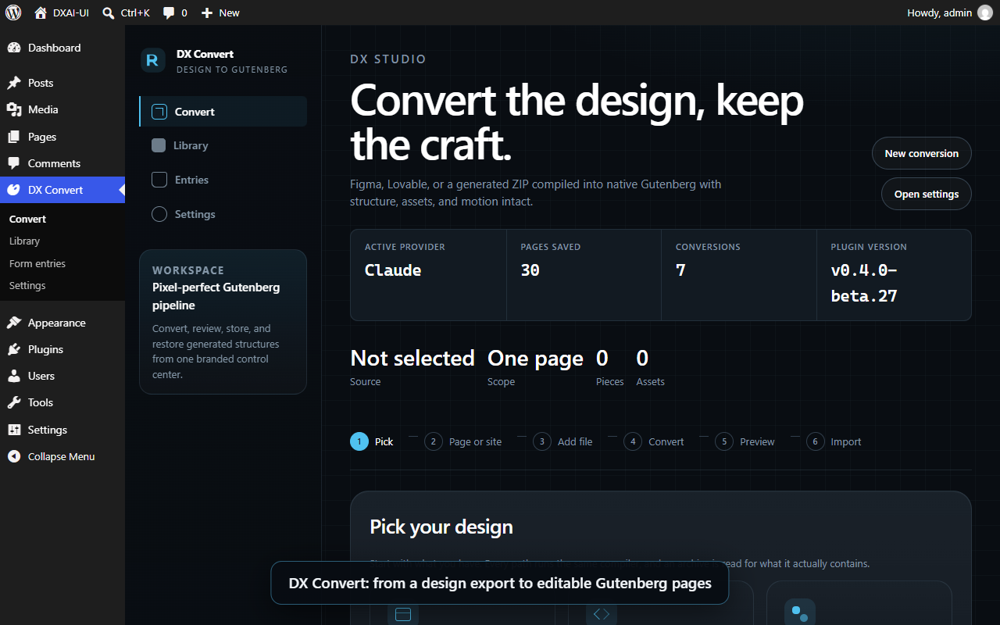

# DX UI

WordPress plugin that turns a design export — **Lovable**, **Claude Design**, a **Vite/React**, **Vue**, **Next.js** or plain **HTML/CSS/JS** archive, a pasted component, or a **Figma** file — into editable Gutenberg pages: every section a block, the header and footer in Appearance › Menus and Widgets (or kept with the page), images and fonts in the site, and the look of the design intact.

> The plugin is called **DX UI** (menu: **DX Convert**); the repository, the text domain and the code still say `dxai-ui`.

[](docs/media/admin-tour.mp4)

*Tour of the admin panel — click the picture to play it (about a minute): Convert, the Library and its tools, Form entries, Settings.*

- [Install](#install)
- [Using the plugin](#using-the-plugin)
- [Working on the plugin](#working-on-the-plugin)
- [More documentation](#more-documentation)

## Requirements

PHP 8.2+ (with `dom`, `libxml`, `mbstring`, `zip`), WordPress 6.6+, an administrator account with `unfiltered_html`, a writable `wp-content/uploads`. A block theme is not required: converted pages use the plugin's own **DX Blank** page template, which works under classic themes too. The full list is in [`readme.txt`](readme.txt).

## Install

1. Get `dxai-ui-<version>.zip` (a release, or build it yourself — see [Build a release](#build-a-release)).
2. **Plugins › Add New › Upload Plugin**, choose the ZIP, **Activate**.
3. Open **DX Convert** in the admin menu.

Activation stops and names any PHP extension that is missing. Do not update the plugin from wp-admin on a site where it is a junction to this repository (see [the working environment](#the-working-environment)).

## Using the plugin

The admin menu **DX Convert** has four screens: **Convert**, **Library**, **Form entries** and **Settings**.

### 1. Settings (only if you need an AI engine)

A design **archive** is compiled by the plugin itself — colours, images, fonts, motion, pages — with no AI call. The AI engines (Anthropic Claude, OpenAI, xAI Grok, DeepSeek) and the Figma token are for a **pasted component**, a **Figma file**, and for *Write with AI* in the Library. Add the keys in **DX Convert › Settings** (keys are encrypted at rest and never sent back to the browser), choose the provider and model, and press **Test active engine**.

### 2. Convert a design

**DX Convert › Convert** is a six-step wizard:

| Step | What you do |
| --- | --- |
| **1 · Pick** | *Design archive → Gutenberg* (one `.zip`), *Paste a component* (JSX/TSX and its CSS), or *Figma → Gutenberg* (a file URL). |
| **2 · Page or site** | *One page* — the design as one page. *Whole site* — the page, its header and footer and, if you like, every page its menu links to, built from the design's sections with the live site's own text and pictures. Then choose what happens to the header and footer: **install** the design's (the header becomes menus in Appearance › Menus, the footer becomes widgets in Appearance › Widgets) or **keep** the site's current ones (the design's stay with its pages as template parts and Menus and Widgets are not touched). |
| **3 · Add file** | Drop the `.zip` (or paste the code, or the Figma URL). |
| **4 · Convert** | The server unpacks and reads the archive, compiles it into blocks and renders a preview. Nothing is saved yet. |
| **5 · Preview** | Check the preview and the fidelity score. |
| **6 · Import** | **Add to WordPress** saves the page (and, for a whole site, its pages, menus and template parts) and runs the import checks. |

Importing the same design again updates its pages in place; nothing on the site is deleted.

**YouTube videos** are never put on a page as a live player: a player loads its scripts and trackers for every visitor, whether anyone watches or not. A YouTube iframe in a design (also the markup an AI engine writes) becomes the team's example: two embeds of the video that are hidden (block visibility, they are what the editor shows, so the address can be changed there) and a facade for the phone and for the desktop (`<div class="youtube-facade" data-video-id data-video-title>`, in the groups "Mobile iFrame" and "Desktop iFrame"). Only the video's id and title change from one video to the next. The player loads when a visitor presses the facade. The facade is drawn (thumbnail and play button) and swapped for the player by a script, and the phone's and the desktop's are told apart by `mobile-show` and `mobile-hide`: the American Restoration theme has the script and the styles. They are not there on a converted page (the theme's scripts and styles are detached from it) or on another theme, so there the plugin prints its own copy (`assets/js/youtube-facade.js`, `assets/css/youtube-facade.css`, 768px as the theme's breakpoint), only on a page that has a facade and never on a page of a theme that brings its own. The two work together if both are loaded. A theme can say it has them with `add_theme_support( 'dxai-youtube-facade' )` or the `dxai_ui_theme_has_youtube_facade` filter. Before WordPress 6.9, which cannot hide a block, only the two facades are written. A map, a playlist or a video file is left as the design wrote it.

### 3. Work with what was made — the Library

**DX Convert › Library** lists what the plugin made (pages, synced patterns, headers and footers, menus, conversion snapshots) with *View*, *Edit*, *Export* and *Restore*, and has one panel for each thing you may want to do with a design:

| Panel | What it does |
| --- | --- |
| **Pages from your live site** | Builds the pages your design links to, with each old page's own text and pictures arranged in the design's sections. The menus and the footer then open the new pages. |
| **Theme colours** | Lets a design take your theme's palette by role (and follow later changes) instead of its own copied colours. |
| **Native blocks** | Uses core and theme blocks (Group, Buttons, Image…) where they say the same thing as a DX block, so a page gets their controls. Pictures are the theme's **DX Picture** (`dx/picture`, the American Restoration theme registers it) where the site has it and the picture is in the media library — a server-rendered `<picture>` with the right file for the screen, the LCP switch and the sidebar to replace the image — and core's Image where it has not (another theme, a picture from another site, an SVG, a picture with CSS of its own, a link, a caption or a shape the block has no attribute for). The block's own default for a phone is a 4:5 crop made for a hero, which would change the shape of every picture of a design, so converted pictures get the uncropped size on both screens (`dxai_ui_picture_sizes` chooses others, `dxai_ui_use_dx_picture` turns it off). Reversible. |
| **Pages in the team's style** | Makes new pages (a service, a place, About, Contact, the questions, the reviews, the lists) from the design's own sections, in the order the team's sites use. What the Home has no section for is made in the Home's own cards from what the site and the Home say: a list of the site's other pages on each page, the page that lists the services or the places shows all of them, and the ways to reach the company (phone, e-mail, address) are on the contact and About pages. A service page opens with what the Home says about that service. The plan is shown first as a strip of sections for each page (its role, whether it is a Home section, which one, or made in the Home's cards, and what was done to it): what is shown is what is made. A page can be shuffled (another page of the same site) with the sections you like locked, and a slider chooses how much is the Home's alone: only its sections, also the ones the site makes, or an AI choosing the sections (one request a page, off by default, its cost shown first, and a plan that breaks a rule is dropped for the usual one). After making, each page is measured against the rules the database can answer (green or red, with the reason), and the last run can be given back: the pages it made go to the trash (nothing is deleted), the pages that were there are put back as they were, the Home's menu links return, and anything changed since is left alone and named. A page can also be checked for free or sent for notes (they are only notes). |
| **Words for the pages** | The prompt for the copy of a page, filled in from the page. Copy it into any assistant, or press **Write with AI** to let the engine chosen in Settings write the words; only the words change and the page can be put back. |
| **Page speed** | See [Fonts and colours follow the theme](#fonts-and-colours-follow-the-theme). Also prints only the part of the theme's stylesheet each page uses. |
| **Generated pages / Import package** | **Export** a finished page with its styles, images, header and footer as a `.dxai.zip` and **import** it on another site where the plugin is active (for example from a local build to production). |

### 4. Fonts and colours follow the theme

A converted page can use the site's own fonts and colours instead of the design's:

- **Fonts**, on a theme that lets the site choose them (the DevriX themes: **Theme Global Settings › Fonts**). Headings use the headline font, everything else — paragraphs, spans, links, buttons, labels — the body font. The design's own fonts are not used and **are not uploaded again**: the page uses the theme's font files and asks for no others. Code (`pre`, `code`) stays monospace and icon fonts keep their glyphs. Nothing in the page's content is rewritten, so a change in Theme Global Settings reaches every design at once. A design that already had its fonts copied is put on the theme's with an update (its font rules leave its stylesheet, kept in a record so they can be put back, and the font files no stylesheet names are removed); a design can be set to keep its own fonts with **Library › Page speed › Use the design's own fonts**.
- A theme that does not manage fonts (a block theme such as Twenty Twenty-Five) leaves designs in their own fonts, copied to the site as before. Another theme can opt in with the `dxai_ui_theme_fonts` filter (the two font stacks, their slugs and the `@font-face` rules to print).
- **Theme Global Settings** (the ACF options page of the DevriX themes), when the site has it and the owner filled a field: the **fonts** and the **colours** as above, the **primary logo** (the header draws it before the Site Logo, as the theme does, and an import does not give the site the design's logo when it has one), and the **radius of buttons and cards** (`border_radius_style`: the theme's own lengths are printed after the theme's button styles on a page that does not load the theme's stylesheet). Without ACF, on another theme, or with a field left empty, nothing is read and everything works as before. `dxai_ui_theme_option` supplies a value from elsewhere.
- **Colours**, on any theme with a palette (classic or block). **Library › Theme colours** binds a design's colours to the theme's palette, by role; switch *Follow the theme's colours* on for the design. Until then it keeps its own.

### 5. Form entries

Forms in converted pages store their submissions in WordPress. **DX Convert › Form entries** lists them (date, email, message, page) and exports a CSV.

### 6. From the command line

`wp dxai-ui …` (add `--user=<admin>` where a command writes):

| Command | What it does |
| --- | --- |
| `export <page-id> [--file=<path>]` | Export a converted page as a `.dxai.zip` package. |
| `import <file> [--chrome=keep\|install] [--dry-run]` | Import a package. |
| `native-blocks status \| apply \| revert [--design=<home-id>] [--dry-run]` | The native-blocks pass. |
| `page-order status \| apply \| revert [--design=<home-id>]` | The order of the sections of a page. |
| `speed status \| apply \| revert \| own \| theme \| clean [--design=<home-id>] [--dry-run]` | Fonts: copy, put back, keep a design's own, use the theme's, remove the files nothing names. `speed trim-on \| trim-off` prints the theme's stylesheet trimmed to each page, or whole. |
| `refresh-runtime` | Bring every stored page script up to the current runtime, now. |
| `repair-styles` | Run the repair of converted posts' stored styles now (it also runs by itself, a batch per admin page load). Every repair is a revision. |

## Working on the plugin

### The working environment

The plugin is developed on Windows with [Local](https://localwp.com/) (PHP 8.2, nginx, MySQL), and the repository *is* the plugin: Local loads it through a directory junction, so every saved file is live.

1. In Local create a site named `DXAI-UI` (domain `dxai-ui.local`, PHP 8.2, nginx, MySQL), as in [`docs/LOCAL-WP.md`](docs/LOCAL-WP.md).
2. Link the repository into the site's plugins folder (a junction, from a Command Prompt):
   ```bat
   mklink /J "C:\Users\<you>\Local Sites\DXAI-UI\app\public\wp-content\plugins\dxai-ui" "C:\path\to\DXAI-UI"
   ```
3. Activate it: `wp plugin activate dxai-ui` (or in wp-admin). Admin: <http://dxai-ui.local/wp-admin/admin.php?page=dxai-ui>.
4. Install the admin build tools: `npm install` (Node 20 or newer).

Local's command-line PHP has no `php.ini`, so scripts that need WordPress go through [`bin/wp-php.sh`](bin/wp-php.sh), which supplies the extensions and the site's MySQL port (Local changes it when it restarts the site; `DXAI_DB_PORT=<port>` overrides). `wp-cli` is not on the PATH either: keep a `wp-cli.phar` and a `dxai-cli.ini` in `.verify/tools/` (git-ignored) and run `php -c .verify/tools/dxai-cli.ini .verify/tools/wp-cli.phar --path=<wp-root> …`.

| Where | What |
| --- | --- |
| `src/` | The PHP plugin (PSR-4 `DXAI_UI\`): `Compiler/` (design → blocks), `Blocks/`, `Structures/`, `Theme/` (theme binding: colours, fonts, fence), `Media/`, `Chrome/` (header and footer), `Transfer/`, `Admin/`, `API/` (REST). |
| `assets/src/admin/` | The React admin app. Built into `assets/build/` (git-ignored). |
| `runtime/` | The small script that runs a converted page's motion and widgets. |
| `bin/` | Verification suites (`verify-*.php`, `verify-import.cjs`), oracles and the release script. |
| `docs/` | Architecture notes and plans. |

### Build the admin app

```bash
npm install          # once
npm run build        # production build into assets/build/
npm start            # watch mode while editing assets/src/admin/
```

The PHP needs no build. `assets/build/` is not committed: `npm run build` creates it, and the release builds it again so a ZIP can never ship a stale bundle.

### Run the checks

Each suite is a PHP script that loads WordPress, runs its checks offline against fixtures, prints `ok` / `FAIL`, and exits non-zero on a failure:

```bash
bash bin/wp-php.sh bin/verify-speed.php            # or: wp eval-file bin/verify-speed.php --user=1
bash bin/wp-php.sh bin/verify-theme-fonts.php
bash bin/wp-php.sh bin/verify-native-blocks.php
bash bin/wp-php.sh bin/verify-team-pages.php
bash bin/wp-php.sh bin/verify-block-library.php
```

| Suite | Covers |
| --- | --- |
| `verify-theme-fonts.php` | The theme's fonts: roles, the rule printed with a page, blocks bound to it, fonts leaving a sheet and coming back, the migration, the clean-up. |
| `verify-dc-media.php` | A Claude Design component that watches two media queries (a mobile one and a wide one) is read with each state following its own query, and each variant is worked out at the width it stands for: the element that reads the wide state depends on no other state (it vanished when a dropdown opened), a state that is true on both sides of the breakpoint needs no media mark, a component with one query is read as before. Nothing is written. |
| `verify-header-menus.php` | A header whose menu is a dropdown or a mega menu is read as menus and the menus draw it again: the converter writes a header row that holds a panel as blocks (and leaves a page's lists and a footer's alone), the reader finds the dropdowns, the columns of a panel, a link's title and its description apart, a picture block's link as the logo, a trigger with no panel as an item of the bar (and not a promo's bullet points inside a panel), the renderer writes a changed title, a changed or emptied description and a new link or dropdown each into its own place. Nothing is written to the database. |
| `verify-menu-pages.php` | The pages a design's header menu names, made at the menu's own addresses (Library > Pages in the team's style, "From the site's menu"): an address read (a page of the site with or without www and a folder, another site, a place on a page, a file, a phone, the Home), the kind of each item told from its address, the dropdown it is in and its words (Five Star's menu: six services, two offices, six towns, About and Testimonials; Careers, the anchors and what has no kind are left out, each with why), the page above a service or a place offered as their list, the menus the design's header was built into read as they are now (a person's edit of them is a page); pages made at their addresses whatever the order asked for, under the page at the address above (a page whose parent is not there waits, and says so), one About where the menu and the general pages both ask, an address that is another page (or another design's) kept as it is, a page this design made found again by its address; the items of the header's menus that led to a section of the Home lead to the pages made (a trigger, a phone, a menu a person made are left), and giving the run back puts them back; the panel's route. |
| `verify-template-fonts.php` | The fonts of the site's template: a design's Google fonts hosted on the site and set as the site's (the Latin faces only, in a folder the clean-up leaves alone, the headline font and the body font told apart, the stacks the design wrote), what they feed (the theme's choice for every design that follows it, every page the theme draws, the block editor, the preload), that a person's choice in the theme's settings wins, and that what cannot be installed changes nothing. Google's answers are made in the suite. |
| `verify-dx-template.php` | The DX template (`templates/dxai-template.php`, `Template_Chrome`) draws a design's header, page and footer as a template does, in the order and the markup DX Blank made (byte for byte once the scope ids are the same), and the pages of earlier imports on DX Blank are drawn as before: one scope element, each part once, the page's stored content is its body only, a page read outside the template (a REST preview, a feed) is its body alone; what a page loses (the skip link, the header spacer: an empty block, one click to delete) is put back from the import's copy and its rules are written with the page's; a header built from Menus; a page of no design is given the skip link and the spacer of the design the site's header came from, before the header, with their rules (written on the front end and not in wp-admin), and a theme's `header.php` (DX Base) gets the same from `Template_Chrome::site_header()`; and the quality measure (`Team_Quality`, `bin/team-quality.cjs`) counts the header the template draws among what opens a page, so a page whose title is a word of the header's menu (a page made from the menu) is not paired with the header. |
| `verify-design-document.php` | The Design IR (`Design\Document`, docs/PLAN-ARCHITECTURE.md section 4): one document per design, built from the compile result before anything is saved and from what the import saved, with its pages and their sections (read as the team pages read a Home), its header and footer and the navigation in them, its tokens, fonts, screens and breakpoints, its assets, its behaviours and the compiler's report; the same design has the same fingerprint before and after a save and on any site; a document with a problem is not kept and the problem is; the store, `GET /design/{id}` (manage_options; 404 for a page that is no design's or a design with no document), `wp dxai-ui design` and the rebuild of a design imported before documents were kept from its conversion snapshot (`wp dxai-ui design rebuild <id>|all`, `POST /design/{id}`); what reads the document: a section's items (what its cards, steps and questions are called), the panel's services and places from them when the Home's cards name none, the pages of a header kept as a template part from the document's navigation (`verify-menu-pages.php`), the save's answer carrying the document's summary (the import summary's tile), `GET /design` for the Library's Design report card, and a page id carried over from another site looked up again by address; the design's own site (`source.origin`: a crawl's origin, else where the header's or the page's links lead) so a header read from a live site names this site's pages and not another site's; each section knowing the structure the compiler made it from (`source_name`) and what the design's classes say of its layout (`layout`: columns by breakpoint, flex direction, centred text, widest content; null where the classes say nothing); against `.verify/dc-minimal.zip` and a Lovable archive of the corpus, with a saved round of the fixture under a name of its own, removed when it ends. |
| `verify-style-variation.php` | A design's tokens as a theme.json style variation (`Design\Style_Variation`) and the theme capability contract (`Theme\Capabilities`): the variation is a version-3 theme.json titled after the design, its palette under the brand design's slugs (the two never drift apart), its fonts, the styles that make it the site's; applied, the theme layer of theme.json has its presets beside the theme's own and the global stylesheet defines them, a plain page is drawn in its look, the design's own page is as it was byte for byte but for the two blocks a brand change rewrites by design (its tokens now refer to the presets) and carries none of the variation's styles; the filter carries the theme's palette forward (a merge replaces it whole) and leaves the styles off a design's page; written only into the plugin's own theme, read as JSON, `GET/POST /design/{id}/variation`; a design that is gone takes its variation with it; the palette the plugin fits a design to leaves the brand design's own presets out on a classic theme too, where they reach theme.json now that the brand's filter runs after the theme's. Against `.verify/dc-minimal.zip` imported under a name of its own and removed when the suite ends; the site's look and brand design are put back. |
| `verify-background-color.php` | A design's background colours are set in the block's Colour panel, not by classes (`Native\Background_Color`, the other half of `Text_Color`): a group, the columns and a column with a `bg-dxai-…` class get the colour as the block's custom colour, or as the site's preset when the design's colour is one; the class is gone, the others stay, the tag says it, the markup parses back; a block whose text colour the other converter set gets the background beside it, both kept on the tag; left as the class: a variant, a gradient or a picture beside it, two colours, a setting already there, a block whose own CSS names a background, a style someone wrote, an attribute this does not move, a paragraph; the brand design's presets reach theme.json after a theme's own filter on the same hook (American Restoration rewrites its palette at 100), so the converter binds to them on such a theme too; the pass converts a design's posts and reverting puts them back byte for byte. |
| `verify-theme-contract.php` | The theme capability contract everywhere (`Theme\Capabilities`, `Theme\Adapters`): the active theme is read through the adapter of its kind (DX Base, a DX theme, a block theme, a classic theme), and only the adapters spell a theme's name or a theme's block; the contract names the theme's picture, link box and label blocks, how they are written, which attributes hold an attachment, the picture block's shape and what the theme brings on its own pages; each adapter is assumed in turn and answers for itself; the converters, the section readers, the chrome and a transfer ask the contract, not a name; and a reader of the plugin's own source (comments left out) finds no theme name and no theme block outside the adapters — proved on a planted string. Nothing on the site is written. |
| `verify-base-theme.php` | DX Base, the theme the plugin carries for a site that has no DX theme (`themes/dx-base`, `Base_Theme`): its files and version, valid PHP, no ACF, the three locations a DX theme names; copied byte for byte into the themes folder (an older copy brought up to date, what the person put in its folder kept, a folder that cannot be written refused, a folder named `dx-base` that holds another theme left alone, a copy that stops halfway said and finished by the next one), recorded, never switched to by itself and nothing in the code deletes; listed from the plugin's own folder where the themes folder cannot be written; counted as a DX theme; and, with the theme active (the site is switched for a few requests and back, in a shutdown function as well), a page of no design, a post, an archive, the search and the 404 page, each over HTTP as a visitor, in the design's header (the spacer under a fixed header, the skip link hidden by its rule) and footer, the design's own page drawn by the plugin with the same elements and words as on the theme the site had, and the theme's plain header and footer from the same menu and widgets when the plugin has none; and the route of Library > Template (`/template`): what the screen is told (the theme, DX Base, whose header and footer are the site's, the fonts, the logo, the links), who may install and who may switch (refused with a reason, `DISALLOW_FILE_MODS` lists the theme from the plugin instead of copying it), an older copy offered the update, and that installing never switches the site. |
| `verify-speed.php` | The stylesheet trim, the theme-sheet trim, the fonts copied into a design's sheet. |
| `verify-native-blocks.php` | The native-block converters, and that apply and revert, run with no user (WP-CLI without `--user`, cron: KSES is on), keep the forms, controls and iframes of a design's pages. |
| `verify-rest-routes.php` | Every REST route, called as the admin screens and the public form call it: who may call what (a visitor, a subscriber, an editor, an administrator with and without `unfiltered_html`, against a table of tiers; a route not in the table is held to the strictest), a visitor refused by each through the server, bad input on every route that writes (a 4xx with a code, never a fatal, no post written), the wizard's chain (process-source, generate-block, preview) on a pasted component with a YouTube iframe, GET settings never carrying an API key, and that every route path the admin app calls exists with the method it uses. Nothing leaves the machine and nothing is saved. |
| `verify-theme-options.php` | What the owner chose in Theme Global Settings is used where a design can use it — the primary logo of the header, the radius of the theme's buttons — and nothing changes without it (no ACF, another theme, an empty field): the field formats of an image, the order of the logos, an import that leaves a site's logo alone, the radius printed after the button styles, and a real ACF option saved and read back. |
| `verify-picture-block.php` | A picture of a design is the theme's DX Picture where the site has the block and core's Image where it has not: what the converter writes (the attachment, the alt, the size the design gave, the design's classes marked for the rules, the uncropped sizes), what it declines (a picture not in the library, an SVG, CSS of its own, a caption, a link, a parent that spaces its children), the site without the block, and that the team's page tools (image slots, another picture in a block, the Home's pool of pictures, the rules for the figure) know the block. |
| `verify-video-facade.php` | A YouTube video is the team's example byte for byte with its id and title, nothing of YouTube is printed until the facade is pressed, an iframe of a design and the markup an engine writes become it, a map, a playlist and a video file are left alone, and the plugin's own script and styles are printed only where the theme does not bring them (a converted page, another theme). |
| `verify-video-facade-view.cjs` | The plugin's facade script and styles in a real browser, with nothing from YouTube asked for until a press: one facade shown at 1200, 769, 768 and 500 px, thumbnail and play button, a click and the Enter key each make one player (youtube-nocookie.com), the script twice or with the theme's own makes still one. `node bin/verify-video-facade-view.cjs [--theme-script <file>]`. |
| `verify-chrome-choice.php`, `verify-chrome-flow.mjs`, `verify-chrome-rules.php` | The header and footer of a design on the site: what an import does when nobody says (a DX theme installs by itself when the site has nothing of its own in Menus and Widgets, and keeps what it has; any other classic theme keeps the site's; a block theme installs; DX Base counts as a DX theme), what the import screen offers and warns about (`node bin/verify-chrome-flow.mjs`: the offer of DX Base to a theme that is not a DX theme included), and a page that borrows its Home's header and footer with the rules of their classes, a header kept as a template part put back after the skip link and the box that holds its place. |
| `verify-team-arrange.php` | The panel's side of the pages: the plan as a strip of sections and that it is what is made, shuffle, locked sections that stay through a shuffle, the three modes, the report after making, giving the last run or one page back (and what is left alone), and the same through the REST route. |
| `verify-block-library.php` | The team's own sections kept in the plugin for the pages made from a Home (`data/block-library`, built from two finished sites by `bin/build-block-library.php`): the data (every section one block of registered blocks, every token and marker one the library reads, the drawings' sizes kept as block settings, nothing of the two sites left in them), the fill (name, phone and places in, escaped; a place with no page is a box, not a link; what needs a fact leaves when it is missing), when a section is used (kind of company, kind of page, theme, what the Home says), the pages made (the library fills what the Home has none of, takes its place when asked, or is not used; a plan makes nothing; a locked section comes back; the Home is not changed), the styles and script printed only for a page that has a section of it, and the editor's patterns. Seven of its checks were run against a bug put back on purpose. The block editor's own judgement of a page made with it: `node bin/editor-roundtrip.cjs --post <id> …`. |
| `verify-team-pages.php`, `verify-page-order.php`, `verify-page-recipes.php`, `verify-copy.php` | Pages in the team's style (and whose page it is, the Home's header and footer on every page, the quality measure), section order, recipes, the copy writer. |
| `verify-section-variants.php` | How a section of the Home is shown another way (order of cards, questions kept, ticks and buttons, sides of a row, pictures), and that nothing the design styles by place is moved. |
| `verify-ai-planner.php` | The optional AI steps against a stand-in engine (nothing asks a provider): what a run costs and its ceiling, the plan an AI is asked for and every rule it is checked against, the pages made from a plan and from a plan that is dropped, what the copy writer may and may not change in the sections the site made, the notes on a page, and the same over REST. |
| `verify-section-blueprints.php` | The sections a page needs that the Home does not have (the site's other pages, the ways to reach the company), made in the Home's own cards: which sets of cards can be poured into, that what is made wears nothing but the Home's look and says only what the site and the Home say, and what the Home states (phone, e-mail, address). |
| `verify-team-quality.php` + `team-quality.cjs` | Not a suite but a measure: the pages made for a design against its Home, gate by gate (header and footer, colours, fonts, frame, reused sections — including a photograph of each section that is the Home's own, compared pixel by pixel with the Home's, mobile, valid blocks, variety, nothing foreign, speed). Needs a Home id and a browser: `bash bin/wp-php.sh bin/verify-team-quality.php <home-id> out=q.json`, then `node bin/team-quality.cjs q.json` (`pixels=0` leaves the photographs out). See [`docs/PLAN-TEAM-PAGES.md`](docs/PLAN-TEAM-PAGES.md). |
| `team-editor.cjs` | The same pages opened in the real block editor, every block checked against what its own code would save: `node bin/team-editor.cjs q.json cookies=<file>` (the two cookies of a test site's administrator; a site in a folder is handled). |
| `verify-converter.php`, `verify-lovable-compile.php`, `verify-lovable-zip.php`, `verify-generated-zip.php` | The compilers and the archive routes. |
| `verify-admin-titles.php`, `verify-structures.php`, `verify-assets.php`, `verify-coverage.php`, `verify-audit.php`, `verify-islands.php`, `verify-cleanup.php`, `verify-bootstrap.php`, `verify-admin-ui.php` | Design titles in the admin lists, saving, assets, coverage and audit of a conversion, islands, clean-up, boot, the admin screens. |
| `verify-import.cjs` | Imports a set of real design ZIPs and measures the result (geometry against the design, block validity in the real editor, behaviour). Needs the paths of PHP, its ini, `wp-cli` and the ZIPs — see its header. |

Run the suites a change can touch before you commit. For a conversion change, also run `verify-import.cjs` on the designs in `Documents/Lovable`.

### Build a release

1. Update the version in `dxai-ui.php` (the header and `DXAI_UI_VERSION`), `package.json`, and `readme.txt` (`Stable tag` and a new `= x.y.z =` entry in the changelog). Commit the change as `Release x.y.z`.
2. Build the ZIP:
   ```bash
   npm run release -- 0.4.0-beta.28      # same as: node bin/release.cjs 0.4.0-beta.28
   ```
   It builds the admin app, stamps the version into a snapshot, checks the promises a release must keep (the runtime ships; uninstall never deletes posts; the PHP and WordPress requirements agree), lints every PHP and JS file that ships, writes `dist/dxai-ui-<version>.zip` with forward-slash names under one `dxai-ui/` folder (the only shape WordPress's plugin upload installs on Linux hosts), and reads the ZIP back to check it. A release that fails a check is not written. `dist/` is git-ignored: attach the ZIP to a GitHub release.
3. Push the commits: `git push origin main`.

### Conventions

- Source files use CRLF line endings; keep a file's endings when you edit it.
- No inline styles in generated content: styles are `dxs-` classes and rules, colours and fonts come from the theme's presets and variables.
- Uninstall removes only the plugin's own settings and never a page, an upload or an import.
- Anything the plugin does must work on shared hosting and a VPS (no local-only scripts, `unfiltered_html` honoured, KSES on).

## More documentation

- [`readme.txt`](readme.txt) — the WordPress.org-style readme: description, requirements, export and import, and the changelog.
- [`docs/ARCHITECTURE.md`](docs/ARCHITECTURE.md), [`docs/PIPELINE-ARCHITECTURE.md`](docs/PIPELINE-ARCHITECTURE.md), [`docs/PIXEL-PERFECT-BLOCKS.md`](docs/PIXEL-PERFECT-BLOCKS.md) — how the compiler and the blocks work.
- [`docs/LOCAL-WP.md`](docs/LOCAL-WP.md) — the Local site and the junction.
- [`docs/PLAN-TEAM-PAGES.md`](docs/PLAN-TEAM-PAGES.md) — the plan for the pages made from a Home page: the rules, the gates, the phases.
- [`docs/PLAN.md`](docs/PLAN.md), [`docs/RESEARCH.md`](docs/RESEARCH.md) — plan and research.
